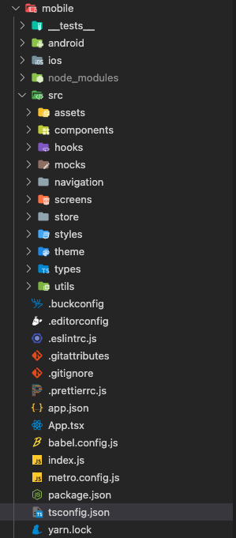

# 프로젝트 구조 설계

## 디렉토리 구조

react-native-cli template typescript를 이용하여 프로젝트를 생성했다.

거기서 src 하위에 모든 소스 코드를 넣기로 했다!

## 네비게이션 구조

이전 프로젝트에서 네비게이션을 잘 활용하지 못했던 것 같아서, 이번에는 설계부터 제대로 했다.

nested navigation이 좀 있어서 성능이 약간 걱정되긴 하지만, 내가 생각해낸 최선의 방법이다.
